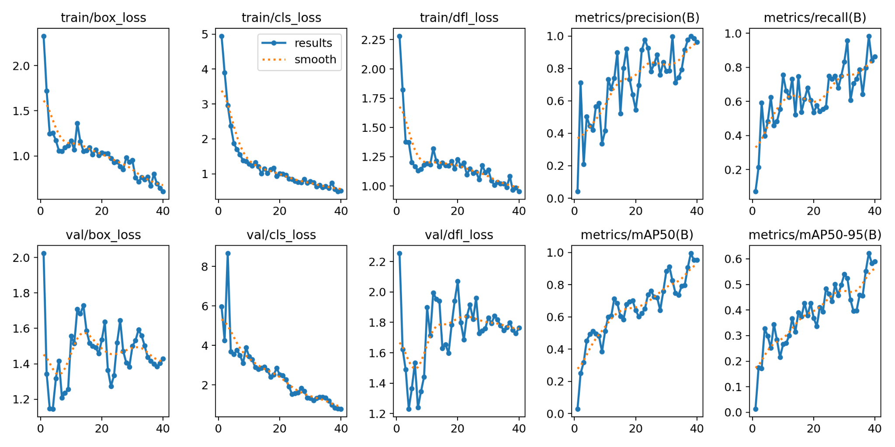
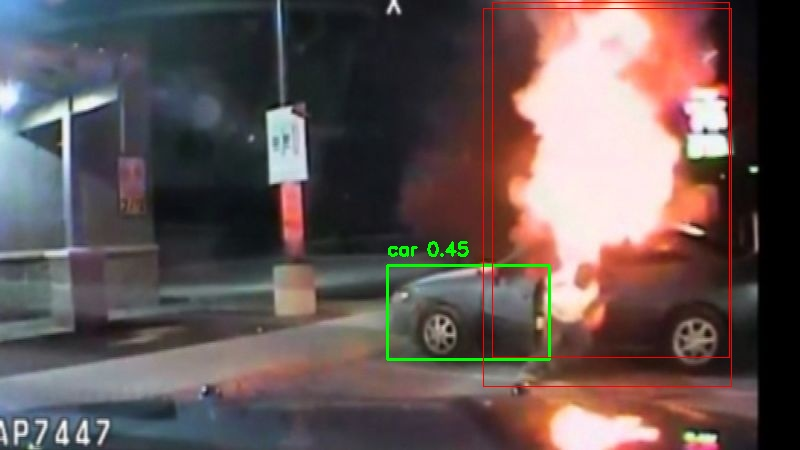
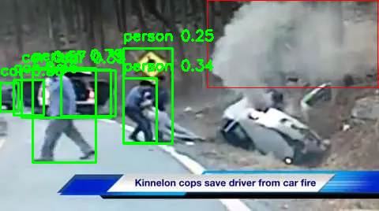

# FiaRe – Firefighter Scene Object Detection

A real-time **object detection system** built for firefighters, designed to identify dangers and potential survivors in accident scenes via body camera footage. Developed as part of **HackMIT 2025** (24-hour hackathon, team of 4).

The system ingests firefighters' biometric and visual data (body camera, temperature, heart rate, O₂ level), processes it in the cloud, and dynamically displays alerts on both a **central panel web dashboard** and individual firefighters' **smart glasses** — enabling real-time situational awareness in high-risk environments.

This repository contains the **AI/ML component**: the object detection pipeline trained to identify cars, persons, and signs of fire/smoke from live body camera footage.

---

## Problem

Firefighters operating in accident scenes face two critical challenges:

1. **Locating survivors** — identifying persons in debris, smoke, or low-visibility conditions
2. **Detecting dangers** — identifying signs of fire, smoke, or vehicle hazards before they escalate

Manual visual scanning under these conditions is error-prone and slow. An AI-powered detection layer running on live camera footage can provide real-time, automated alerts to both individual firefighters and their command center.

---

## Detection Pipeline

```
Body Camera Feed (live video)
        │
        ▼
┌──────────────────────────────────────┐
│  YOLOv8 Object Detection Model       │
│  Detects: person | car | fire/smoke  │
└──────────────────────────────────────┘
        │
        ▼
Cloud Processing & Alert Generation
        │
        ├──► Central Panel Web Dashboard (command center)
        └──► Smart Glasses Display (individual firefighters)
```

---

## Model & Training

**Model:** YOLOv8 (Ultralytics), fine-tuned on a custom-labeled dataset

**Dataset:** 16,000+ images — collected from publicly available accident and fire footage, manually labeled across 3 classes:

- `person` — potential survivors
- `car` — vehicles involved in accidents
- `fire/smoke` — active danger zones

**Training:** 40 epochs on Google Colab (T4 GPU)

### Training Results



All three loss components (box, classification, DFL) converge smoothly on both training and validation sets across 40 epochs.

| Metric    | Value |
| --------- | ----- |
| Precision | ~95%  |
| Recall    | ~80%  |
| mAP@50    | ~95%  |
| mAP@50-95 | ~60%  |

---

## Example Detections

**Car fire scene** — car (green) and fire/smoke (red) detected simultaneously:



**Multi-person rescue scene** — multiple persons (green) and fire/smoke (red) detected under low-visibility conditions:



---

## Tech Stack

| Component           | Tool                             |
| ------------------- | -------------------------------- |
| Object Detection    | YOLOv8 (Ultralytics)             |
| Baseline Comparison | Haar-Cascade Classifier (OpenCV) |
| Training Runtime    | Google Colab, T4 GPU             |
| Visualization       | OpenCV, Python                   |
| Backend Integration | Cloud-based processing pipeline  |

---

## Repository Structure

```
├── Hackmit/
│   └── Hackmit/Export_modules/
│       ├── detectAndLabel.py       # Main detection and labeling pipeline
│       └── models/                 # Trained YOLOv8 model weights
├── Img_Recognition/
│   └── car_detection.py            # Video visualization module
├── training_graph.png              # Training metrics across 40 epochs
├── detected_accident_1.jpeg        # Example: multi-person rescue scene detection
├── detected_accident_2.png         # Example: car fire scene detection
└── README.md
```

---

## My Contributions

As **Lead of AI Development**, I had sole end-to-end ownership of the object detection module - from dataset collection and labeling through model selection, training, and integration into the broader system pipeline:

- **Data collection and labeling** — sourced and manually labeled 16,000+ images across 3 detection classes (person, car, fire/smoke), ensuring class balance and coverage across diverse lighting and scene conditions
- **Model training and evaluation** — trained and systematically compared two object detection architectures: Haar-Cascade (OpenCV) as a baseline and YOLOv8 as the primary model; evaluated on precision, recall, and mAP metrics
- **Pipeline development** — implemented `detectAndLabel.py`, the core detection module that processes video frames, runs inference, and outputs annotated detections for downstream alert generation
- **Model selection** — validated YOLOv8 as the superior model based on evaluation results, achieving ~95% precision and ~80% recall on the test set

---

## Context

FiaRe was built in 24 hours at **HackMIT 2025** by a team of 4. The full system integrates biometric monitoring, cloud processing, a web dashboard, and smart glasses display — of which this repository covers the object detection component.
